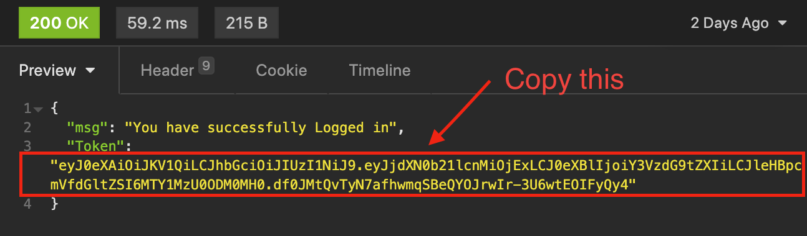
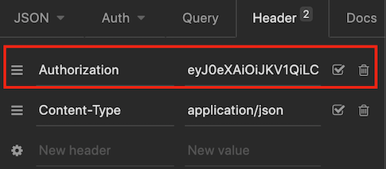

# Joe Tam's portfolio project 3

## Description
In previous module, I developed a flask application of a restaurant which provided some simple functions like create an order, assigning staff to handle an order, etc.

In this project, I have re-written it using django framework, here are the criterias I have achieved in this project:

- Data query using ORM
- Leverage AWS ECS (Elastic Container Services) to deploy my project
- Apply JWT (Json Web Tokens) as authentication of api calls

## Testing
* In this project, I have provided 2 testing approaches, pytest and a python file: test.py
* Prerequesites
    - BASH Shell or VSCode
    - python virtual environment
    - Python modules in app/restapp/requirements.txt installed properly

1. Setup Python Virtual environment, go the folder that app folder reside, e.g django_project:
    > python -m venv venv
2. Install python modules
    > cd app  
    > python -m pip install -r ./requirements.txt
3. Compare the installed modules using "pip list" command against requirements.txt.

4. Using pytest for integration test, you should get "2 passed" at the end of execution.
    > pytest -vv
5. Using test.py for database and api test, you should get "All tests successfully completed" message at the end of execution.
    > cd app  
    > python test.py
 
## Build
* Follow these steps if you want to run the django application in a docker container
* Prerequisites
    - Docker 
    - Bash Shell
1. go to app folder
    > cd app
2. if you want to run the container locally, edit DockerFile and add following lines under "ENV PYTHONUNBUFFERED=1", assume than your db server is postgresql
    > ENV DB_NAME=proj3  
    > ENV DB_USER=\<your database username>  
    > ENV DB_PASSWORD=\<your database password>  
    > ENV DB_HOST=\<ip or hostname of your database server>  
    > ENV DB_PORT=5432  
    > ENV ENGINE=django.db.backends.postgresql
    
3. Build the docker image
    > docker build -t django_rest_app .

## Deployment
*  Prerequisites
    - For AWS deployment
        - ECS cluster with task definition
     - ECR for docker images
        - RDS Postgresql instance with a database "proj3"
        - Security group for RDS instance above allows TCP 5432 connections from ECS EC2 instances
    - For local deployment
        - create a .env file in app/restapp folder for database information, refer to the content of [step 2 of Build section above](#db)
        - Postgres instance in your local machine with a database "proj3"
* DB Initialize procedure (Needed only for first time startup),if it is deployed in ECS, refer step 1 - 3 below, for local deployment, refer to step 4. Then go directly to step 5.

    1. Access the ECS EC2 instance using SSH:
        > ssh -i \<your keypair> ec2-user@\<your ec2 instance>
    2. Get the container ID, suppose your image name is django_rest_app:
        > docker ps | grep django_rest_app
    3. Access docker container:
        > docker exec -it \<your container id> /bin/bash
    4. [For local deploymenr] Start django app:
        > python manage.py runserver 0.0.0.0:8000
    5. Make a migration for django base tables:
        > python manage.py makemigrations
    6. Apply the migration to RDS:    
        > python manage.py migrate
    7. Make a migration for Staffs app:
        > python manage.py makemigrations staffs
    8. Apply the migration for Staffs app to RDS: 
        > python manage.py migrate staffs
    9. Make a migration for Customers app:
        > python manage.py makemigrations customers
    10. Apply the migration for Customers app to RDS: 
        > python manage.py migrate customers
    11. Make a migration for Orders app:
        > python manage.py makemigrations orders
    12. Apply the migration for Orders app to RDS:
        > python manage.py migrate orders

* (Optional) Load sample data into RDS
    1.  Load Staffs data，this will return 2 login ids and passwords for manager, please record it for future usage.
        > python sample_data.py
    2.  Load Customers data
        > python sample_data_customers.py
    3.  Load Orders data
        > python sample_data_orders.py  

## Operations
* This project uses JWT (Json Web Tokens) as an authentication approach. Without logged into the application and set Authorization header in Insomnia or Postman, you will be denied in most endpoints.
* Insomnia_joetam_bak.json file contains all enpoints of this project, you may import it into Insomnia and using it to test functionalities provided by this project.  
* To set Authorization Header:

    1. Proceed login at staffs/login or customers/login endpoint, copy the value of "Token", make sure not to copy the double-quotes character.

        

    2. In the Headers tab of Insomnia, set a Header "Authorization" and paste the Token copied above as value.
    The Header is only valid for current request, meaning that you need to repeat this step on another requests.

        

    3. The token only valids for 30 minutes, you need to re-login when it is expired.

    
